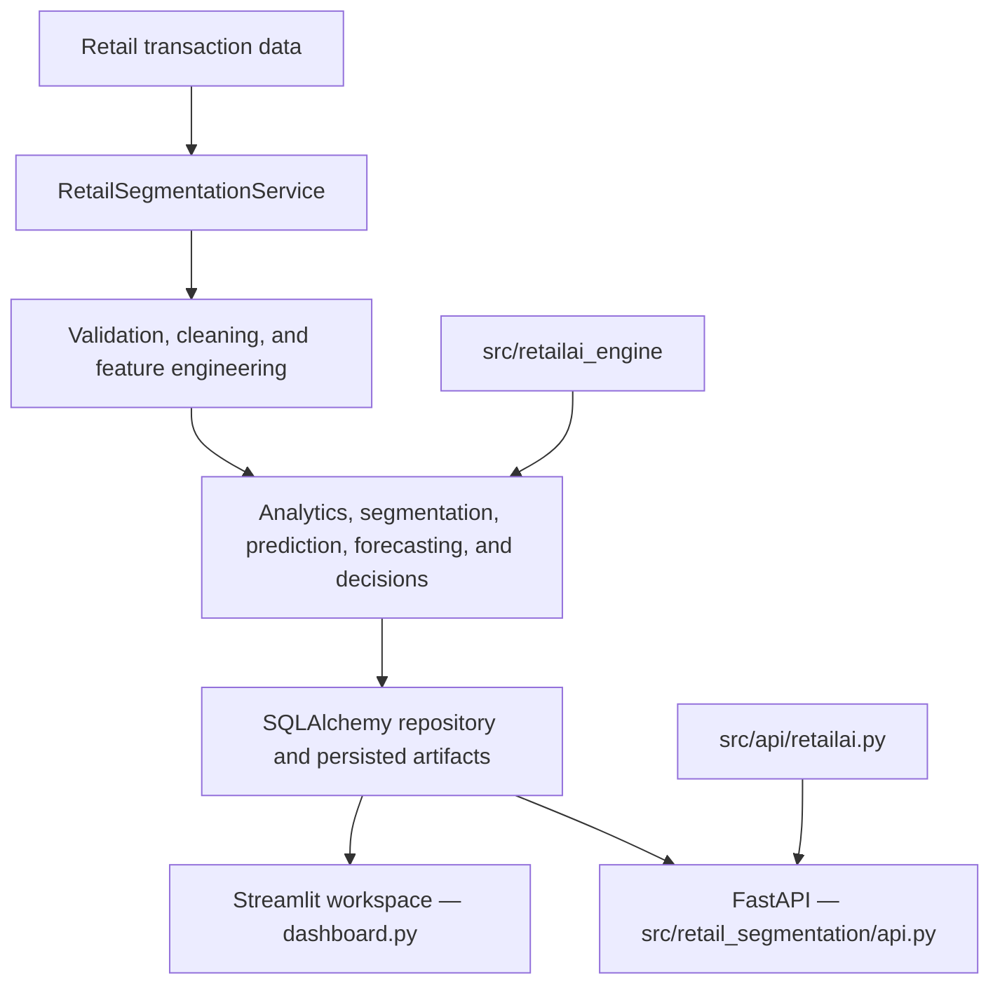

# MeridianAI

MeridianAI is an AI-powered retail intelligence platform that converts transaction data into customer analytics, segmentation, predictive signals, campaign decisions, forecasts, recommendations, data-quality evidence, and explainable model outputs.

The application combines a Streamlit workspace, a shared analytics and machine-learning service layer, persisted artifacts, and FastAPI. RetailAI Nexus is the historical name of the advanced engine integrated into MeridianAI; **MeridianAI is the current project name**.

> Research note: several supervised outputs use proxy or feature-derived targets when observed future outcomes are unavailable. These outputs are engineering demonstrations, not evidence of causal or production generalization. See [Research and model-validity notes](#research-and-model-validity-notes).

## Capabilities

- Transaction ingestion from CSV, XLSX, XLS, or JSON
- Automatic mapping of common retail column names
- Validation, cleaning, profiling, and data-quality reporting
- Customer aggregation and RFM analytics
- K-Means, DBSCAN, hierarchical clustering, and anomaly detection
- Customer personas, tiers, health, CLV, and churn-risk scoring
- Purchase, churn, next-purchase, and 90-day-spend predictions
- Logistic Regression, Decision Tree, Random Forest, and XGBoost churn comparison
- Sales forecasting and uncertainty estimates
- Campaign prioritization and customer-treatment decisions
- Popularity, collaborative, cross-sell, upsell, and similarity recommendations
- Model comparison, feature importance, and explainability outputs
- Streamlit dashboard and 47-operation FastAPI interface

## Workspace navigation

The Streamlit application contains two primary pages, three grouped menus, and one global Data control.

| Location | Pages or controls |
|---|---|
| Primary | Overview; Customers |
| Intelligence | Predictive Engine; Model Trust; Advanced ML |
| Analytics | Customer Visuals; Data Quality |
| Actions | Campaigns; Sales Planning; Recommendations; Explainability |
| Data | Upload a dataset; restore secure demo data; map fields; run analysis |

The eleven functional pages are:

1. **Overview** — portfolio metrics, operating signals, priorities, and summaries.
2. **Customers** — customer search, filters, records, and intelligence export.
3. **Predictive Engine** — a specific-customer or filtered-profile decision report.
4. **Model Trust** — model metrics, thresholds, caveats, and interpretation.
5. **Advanced ML** — advanced segmentation, model comparison, and customer scoring.
6. **Customer Visuals** — tier, persona, cohort, risk, value, and forecast visualizations.
7. **Data Quality** — active-dataset validation, cleaning evidence, and export.
8. **Campaigns** — prioritized campaign treatments, offers, channels, and incentives.
9. **Sales Planning** — forecast and customer-value planning outputs.
10. **Recommendations** — customer-level product recommendations.
11. **Explainability** — model explanation outputs.

Uploaded data remains in Streamlit session state while the user navigates the workspace. Running an uploaded analysis with `persist=False` avoids overwriting the bundled persisted demo state.

## Data contract

The canonical transaction fields are:

| Field | Required | Meaning |
|---|---:|---|
| `invoice_id` | Yes | Order or invoice identifier |
| `customer_id` | Yes | Customer identifier |
| `invoice_date` | Yes | Transaction timestamp |
| `quantity` | Yes | Units purchased or returned |
| `unit_price` | Yes | Per-unit price |
| `stock_code` | No | Product identifier |
| `product_name` | No | Product description |
| `country` | No | Transaction country |

The mapper recognizes common alternatives such as `Invoice`, `InvoiceNo`, `Customer ID`, `InvoiceDate`, `Price`, and `UnitPrice`. The Data control displays unresolved fields before analysis.

The shared predictive feature contract is:

```text
recency_days
frequency
monetary_value
avg_order_value
tenure_days
purchase_rate
return_rate
product_diversity
```

Shared preprocessing replaces infinite values, handles missing numeric values, converts features to numeric form, and applies scaling where the selected model requires it.

## Architecture

Streamlit and FastAPI are separate presentation interfaces over the same service, repository, and engine layers. The Streamlit application does not call FastAPI.



See [docs/architecture.md](docs/architecture.md) for component responsibilities and runtime flows.

## Repository structure

```text
MeridianAI/
├── dashboard.py
├── requirements.txt
├── .streamlit/config.toml
├── artifacts/
├── data/
├── database/
├── docs/
│   ├── API_REFERENCE.md
│   ├── CONFIGURATION.md
│   ├── DATA_GOVERNANCE.md
│   ├── DATABASE_DICTIONARY.md
│   ├── DEPLOYMENT_RUNBOOK.md
│   ├── MODEL_CARD.md
│   ├── NOTEBOOK_TRACEABILITY.md
│   ├── RELEASE_CHECKLIST.md
│   ├── RESEARCH_EVALUATION_PLAN.md
│   ├── architecture.md
│   ├── project_report.md
│   └── retailai_additions.md
├── Notebooks/
├── Reports/
├── src/
│   ├── api/
│   │   ├── retailai.py
│   │   └── run.py
│   ├── retail_segmentation/
│   │   ├── api.py
│   │   ├── service.py
│   │   ├── database.py
│   │   ├── data.py
│   │   ├── analytics.py
│   │   ├── clustering.py
│   │   ├── predictive.py
│   │   ├── forecasting.py
│   │   └── recommendations.py
│   └── retailai_engine/
│       ├── advanced.py
│       ├── churn_pipeline.py
│       ├── production_pipeline.py
│       ├── forecast_engine.py
│       ├── recommendation_engine.py
│       └── explainability.py
└── tests/
```

## Local setup

### Prerequisites

- Python 3.11 is the repository's configured development version.
- Run the following commands from the repository root.

### Install

```powershell
python -m venv .venv
.\.venv\Scripts\Activate.ps1
python -m pip install -r requirements.txt
```

### Run Streamlit

```powershell
streamlit run dashboard.py
```

Open `http://localhost:8501`.

### Run FastAPI

Use the canonical launcher:

```powershell
python -m src.api.run
```

Equivalent direct command:

```powershell
uvicorn src.retail_segmentation.api:app --reload
```

Do not use `src.retail_segmentation.main:app`; `main.py` is the command-line pipeline, not the FastAPI application.

Open:

- API: `http://127.0.0.1:8000`
- Swagger UI: `http://127.0.0.1:8000/docs`
- OpenAPI JSON: `http://127.0.0.1:8000/openapi.json`

The API is versioned internally as `1.0.0` and currently has no authentication layer. Do not expose it publicly without authentication, authorization, transport security, rate limiting, input limits, and appropriate deployment controls.

See [docs/API_REFERENCE.md](docs/API_REFERENCE.md) for all 47 operations and [docs/CONFIGURATION.md](docs/CONFIGURATION.md) for environment and persistence settings.

### Run the pipeline directly

```powershell
python -m src.retail_segmentation.main --demo
python -m src.retail_segmentation.main --input path\to\transactions.csv
```

### Run tests

```powershell
pytest
```

The repository contains tests intended to cover pipeline behavior, validation, transformations, segmentation, churn, forecasting, recommendations, explainability, advanced ML, and API error handling. The current full suite does **not** collect successfully: several tests still import removed package paths such as `src.api.main`, `src.preprocessing`, and `src.forecasting`, while some direct package imports require `src` on `PYTHONPATH`. Treat test repair as required work before claiming automated regression coverage.

## Persistence and configuration

- Default database: `artifacts/retail_segmentation.db`
- Database implementation: SQLAlchemy
- Optional database URL: `DATABASE_URL`
- Default random state: `42`
- K-Means candidate range: 2–8 clusters
- Streamlit upload limit: 200 MB

SQLite works without extra configuration. PostgreSQL requires a valid `DATABASE_URL` and a separately installed compatible driver such as `psycopg`; that driver is not included in `requirements.txt`.

Generated artifacts must remain coupled to the code, feature contract, data snapshot, and evaluation record that produced them. Do not treat the bundled demo artifacts as production models.

The raw `online_retail_II.csv` fingerprint matches the UCI Online Retail II dimensions and date range. Source-chain confirmation, citation, and governance requirements are documented in [docs/DATA_GOVERNANCE.md](docs/DATA_GOVERNANCE.md). Current table definitions are documented in [docs/DATABASE_DICTIONARY.md](docs/DATABASE_DICTIONARY.md), and bundled artifact hashes and metric limitations are documented in [docs/MODEL_CARD.md](docs/MODEL_CARD.md).

## API overview

The canonical application combines base serving routes with the advanced MeridianAI router. It exposes 47 operations across health, analysis, customers, analytics, segmentation, churn, forecasting, campaigns, recommendations, data quality, and model outputs.

Routes are mounted at the root; there is no `/retailai` prefix. See [docs/API_REFERENCE.md](docs/API_REFERENCE.md).

## Deployment

The current Streamlit deployment model is:

```text
Local validation → Git commit → GitHub main → Streamlit Cloud → dashboard.py
```

Before deployment:

1. Run the tests.
2. Exercise upload, demo, navigation, predictions, and downloads locally.
3. Start FastAPI and verify `/health`, `/docs`, and representative routes.
4. Confirm required runtime artifacts are available and compatible.
5. Keep secrets outside Git; `.streamlit/secrets.toml` is ignored.
6. Confirm dependency and Python-version compatibility.
7. Commit and push intentionally, then verify the deployed application.

Deployed Streamlit application: `https://meridian-ai.streamlit.app/`

Deployment health and the deployed commit are operational state and must be verified at release time.

## Research and model-validity notes

MeridianAI is both an engineering platform and a research foundation. Reported metrics must be interpreted according to the target and evaluation design.

Current limitations include:

- Some churn labels can be proxy labels rather than observed outcomes.
- Some future targets can be derived from current customer features.
- Some bundled regression metrics are in-sample engineering diagnostics.
- High metrics may reflect target leakage, an overly easy target, imbalance, or train/test contamination.
- Bundled data and artifacts do not establish performance on a new retailer or future time period.

Research-quality evaluation should use versioned data snapshots, time-forward splits, targets observed strictly after the feature cutoff, appropriate baselines, calibration, uncertainty, drift analysis, and explicit limitations. Results must not be manufactured or presented beyond what the evaluation supports.

See [docs/project_report.md](docs/project_report.md) for the current technical and research summary.

The planned leakage-safe experimental protocol, baselines, ablations, calibration, uncertainty, robustness, and reproducibility requirements are specified in [docs/RESEARCH_EVALUATION_PLAN.md](docs/RESEARCH_EVALUATION_PLAN.md). Notebook relationships to production modules are mapped in [docs/NOTEBOOK_TRACEABILITY.md](docs/NOTEBOOK_TRACEABILITY.md).

## Project status

Implemented:

- Streamlit retail intelligence workspace
- Shared processing and persistence service
- Customer analytics, segmentation, personas, tiers, health, and risk
- Predictive customer models and churn comparison
- Forecasting, recommendations, campaigns, and sales planning
- Data-quality, model-trust, and explainability views
- FastAPI application with generated OpenAPI documentation
- Test modules for major pipeline and API components; full-suite import repair is still required

Operational and research work still required:

- Production authentication and API hardening
- External artifact storage and model/version registry
- Observed future-outcome labels
- Time-forward and out-of-sample evaluation
- Drift monitoring and scheduled ingestion
- Deployment release/version tracking
- Formal license and dataset provenance review
- Test import migration and a green full-suite run

These are confirmed future commitments. Their scope and completion criteria are maintained in [docs/ROADMAP.md](docs/ROADMAP.md).

## Documentation index

- [API reference](docs/API_REFERENCE.md)
- [Configuration and operations](docs/CONFIGURATION.md)
- [Data governance and provenance](docs/DATA_GOVERNANCE.md)
- [Database dictionary](docs/DATABASE_DICTIONARY.md)
- [Model and artifact card](docs/MODEL_CARD.md)
- [Notebook-to-production traceability](docs/NOTEBOOK_TRACEABILITY.md)
- [Research evaluation plan](docs/RESEARCH_EVALUATION_PLAN.md)
- [Architecture](docs/architecture.md)
- [Technical and research report](docs/project_report.md)
- [Deployment and recovery runbook](docs/DEPLOYMENT_RUNBOOK.md)
- [Release checklist](docs/RELEASE_CHECKLIST.md)
- [Future-work roadmap](docs/ROADMAP.md)
- [Historical RetailAI Nexus integration note](docs/retailai_additions.md)
- [Changelog](CHANGELOG.md)
- [Security policy](SECURITY.md)
- [Contributing guide](CONTRIBUTING.md)

## License and data usage

No formal open-source license is currently included. Until a `LICENSE` file is added, do not assume permission to redistribute or reuse the repository beyond applicable law and explicit authorization.

Do not commit credentials, private customer data, secrets, or retailer-confidential information. Confirm the provenance, terms, and redistribution rights of every dataset and generated artifact before public or production use.
