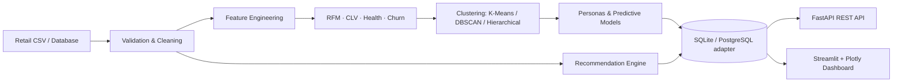

# Architecture

## Components

| Layer | Responsibility |
|---|---|
| Data engineering | Canonicalizes source fields, validates schema, removes malformed/duplicate rows, calculates revenue and return flags. |
| Analytics | Builds RFM scores, proxy CLV, explainable churn risk, health score, and exclusive customer personas. |
| Machine learning | Robust-scaled K-Means selection by silhouette score; DBSCAN and hierarchical results retained as governance benchmarks. |
| Predictive | Random forest purchase, churn, next-purchase and 90-day-spend models. The bundled demo uses transparent proxy labels; replace them with time-forward outcomes in production. |
| Serving | SQLite tables plus persisted model artifacts, exposed through FastAPI and Streamlit. |

