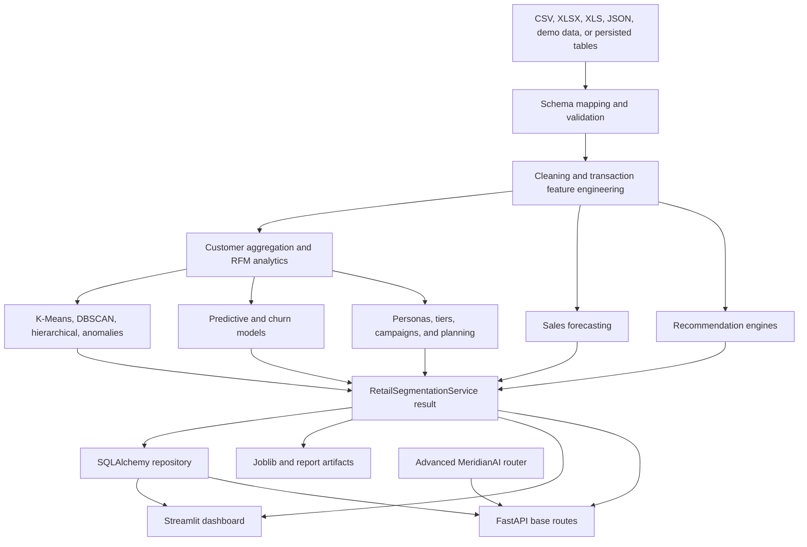

# MeridianAI architecture

## System context

MeridianAI is a batch-oriented retail intelligence application with two presentation interfaces over a shared Python service and persistence layer:

- `dashboard.py` provides the Streamlit workspace.
- `src/retail_segmentation/api.py` provides the canonical FastAPI application.
- `src/retail_segmentation/service.py` coordinates the processing pipeline.
- `src/retail_segmentation/database.py` persists frames through SQLAlchemy.
- `src/retailai_engine/` provides advanced segmentation, churn, forecasting, recommendation, validation, and explanation functionality.
- `src/api/retailai.py` adds the advanced API routes to the canonical FastAPI application.

Streamlit does not call FastAPI. Both interfaces use the same underlying application modules and persisted state.

## Package responsibilities

| Component | Responsibility |
|---|---|
| `dashboard.py` | Navigation, uploads, field mapping, session-state analysis, charts, decision reports, filters, and downloads |
| `retail_segmentation.data` | Canonical schema, automatic mapping, validation, and cleaning |
| `retail_segmentation.analytics` | Customer aggregation, RFM, personas, tiers, health, risk, campaigns, cohorts, and summaries |
| `retail_segmentation.clustering` | K-Means selection, DBSCAN, hierarchical benchmarks, and Isolation Forest |
| `retail_segmentation.predictive` | Purchase, next-purchase, spending, and proxy-churn model bundle |
| `retail_segmentation.forecasting` | Baseline sales-forecast generation |
| `retail_segmentation.recommendations` | Persisted recommendation engine used by the base API and UI |
| `retail_segmentation.service` | End-to-end orchestration and optional persistence |
| `retail_segmentation.database` | SQLAlchemy-backed frame repository; SQLite by default and `DATABASE_URL` override |
| `retail_segmentation.api` | Canonical FastAPI app and base serving routes |
| `api.retailai` | Advanced analytics, churn, forecast, recommendation, segmentation, and model routes |
| `retailai_engine` | Reusable advanced ML, validation, artifact, forecasting, recommendation, and explanation modules |

## Streamlit runtime flows

### Bundled or persisted state

1. The dashboard initializes the repository and service.
2. If required tables are unavailable, it runs demo data to establish usable state.
3. The dashboard loads named frames and model artifacts.
4. Navigation pages render from the active dataset.

### Uploaded state

1. The user chooses CSV, XLSX, XLS, or JSON in the Data popover.
2. The dashboard maps common source names to the canonical schema.
3. The user resolves any missing required fields.
4. The dashboard runs the service with `persist=False`.
5. Result frames remain in Streamlit session state across page navigation.

This separation prevents exploratory uploads from silently replacing the bundled persisted database.

## API runtime flow

`python -m src.api.run` launches `src.retail_segmentation.api:app`. That application includes `src.api.retailai.router` without a path prefix and initializes the shared repository and service.

The resulting OpenAPI surface contains 47 operations. See [API_REFERENCE.md](API_REFERENCE.md).

## Persistence

The default SQLAlchemy database points to `artifacts/retail_segmentation.db`. `DATABASE_URL` can override the connection. Pipeline persistence replaces named tables rather than applying incremental migrations.

Serialized models and supporting outputs are held under `artifacts/`, `Reports/`, and `data/processed/`. Production use requires explicit data, code, dependency, and artifact version coupling.

## Security and deployment boundaries

The current FastAPI application has no authentication or authorization. The repository is suitable for local development and academic demonstration, not direct public API exposure.

Production hardening requires authentication, authorization, secret management, HTTPS, request limits, rate limiting, audit logging, monitoring, backups, migrations, and controlled artifact distribution.

## Research-validity boundary

The architecture can produce technically valid files and endpoints even when an ML experiment is scientifically weak. Research evaluation must separately verify target construction, temporal separation, leakage prevention, baselines, uncertainty, calibration, and out-of-sample performance.
